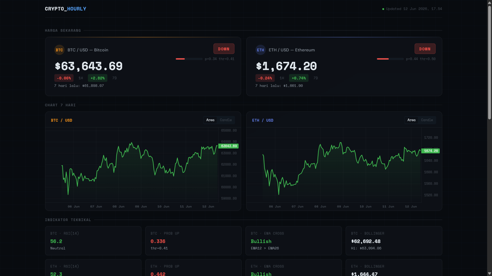
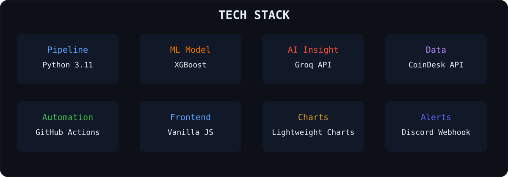

<p align="center">
  
</p>

<p align="center">


</p>

---

## What it does

CryptoHourly is a self-updating cryptocurrency dashboard that runs every 15 minutes using GitHub Actions.

The system fetches live OHLCV data for Bitcoin and Ethereum, generates engineered technical features, runs each asset through a dedicated XGBoost classifier, and publishes the resulting market signal to a static GitHub Pages dashboard.

Features include:

- Hourly BTC & ETH directional prediction
- Asset-specific XGBoost models
- Tuned probability thresholds
- Automated Discord notifications
- AI-generated market commentary via Groq
- Historical prediction logging
- Fully static frontend powered by GitHub Pages

No server, database, or cloud infrastructure is required.

---

## Preview



---

## Architecture

```text
CoinDesk API
      │
      ▼
fetch_predict.py
      │
      ├── XGBoost Classifier
      ├── Groq Insight
      ├── Discord Notification
      ▼
 data/*.json
      ▼
 GitHub Pages
```

---

## Tech Stack

<p align="center">
  
</p>

---

## Model

CryptoHourly uses two independent XGBoost classifiers:

| Asset | Features | Threshold |
|---------|---------|---------|
| BTC-USD | 29 | 0.41 |
| ETH-USD | 37 | 0.50 |

### Target

```python
Target = 1 if Close(T+1) > Close(T) else 0
```

The model predicts the probability that the next hourly candle closes higher than the current candle.

---

### BTC-USD Features (29)

```text
Open
High
Low
Close
Volume

RSI_14

EMA_12
EMA_26
EMA_Spread

ATR_14
ATR_Ratio

BB_Upper
BB_Middle
BB_Lower
Dist_BB_Upper
Dist_BB_Lower
BB_Position

MA50_1D
Dist_MA50_1D
Trend_1D

Close_Lag_1
Close_Lag_2
Close_Lag_3

Return_1H
Return_2H
Return_3H

Volume_MA20
Volume_Ratio

Volatility_24H
```

---

### ETH-USD Additional Features (+8)

```text
Dist_EMA12
Dist_EMA26

Trend_Strength

RSI_Overbought
RSI_Oversold

Candle_Range
Body_Size

Volume_Change
```

---

### Signal Decision

```python
prob_up = model.predict_proba(X)[0][1]

signal = (
    "UP"
    if prob_up >= threshold
    else "DOWN"
)
```

---

## Repository Structure

```text
.
├── scripts/
│   └── fetch_predict.py
│
├── model/
│   ├── xgb_tuned_BTC-USD.pkl
│   ├── xgb_tuned_ETH-USD.pkl
│   ├── threshold_BTC-USD.pkl
│   └── threshold_ETH-USD.pkl
│
├── data/
│   ├── prices.json
│   ├── prediction.json
│   ├── pred_log.json
│   ├── run_log.json
│   ├── logs_auth.json
│   └── _timestamp.txt
│
├── assets/
│   ├── banner.svg
│   ├── tech-stack.svg
│   └── crypho-website.jpg
│
├── index.html
├── requirements.txt
│
└── .github/
    └── workflows/
        └── hourly.yml
```

---

## Generated Files

| File | Purpose |
|--------|--------|
| prices.json | Latest OHLCV data |
| prediction.json | Signal output and indicators |
| pred_log.json | Historical predictions |
| run_log.json | Workflow execution history |
| logs_auth.json | Admin login hashes |

---

## Workflow Schedule

GitHub Actions executes the pipeline every:

```text
03
18
33
48
```

minutes of every hour.

A timing guard prevents duplicate executions caused by scheduler drift.

---

## Setup

### 1. Clone Repository

```bash
git clone https://github.com/yourname/crypto-hourly.git

cd crypto-hourly
```

---

### 2. Install Dependencies

```bash
pip install -r requirements.txt
```

---

### 3. Configure GitHub Secrets

Navigate to:

```text
Settings
└── Secrets and variables
    └── Actions
```

Create:

| Secret | Description |
|----------|----------|
| COINDESK_API_KEY | CoinDesk API Key |
| GROQ_API_KEY | Groq API Key |
| DISCORD_WEBHOOK | Discord Webhook URL |
| LOGS_USERNAME | Dashboard Login |
| LOGS_PASSWORD | Dashboard Password |

---

### 4. Add Trained Models

```text
model/
├── xgb_tuned_BTC-USD.pkl
├── xgb_tuned_ETH-USD.pkl
├── threshold_BTC-USD.pkl
└── threshold_ETH-USD.pkl
```

---

### 5. Enable GitHub Pages

```text
Settings
└── Pages

Branch:
main

Folder:
/
(root)
```

---

### 6. Run Workflow

```text
Actions
└── Hourly Data & Prediction
    └── Run Workflow
```

---

## Requirements

```text
requests
pandas
numpy
joblib
xgboost
scikit-learn
cairosvg
```

---

## Data Sources

Primary:

- CoinDesk

Fallback:

- Kraken
- Bitstamp
- Gemini

If a provider fails, the fetcher automatically rotates through available exchanges before aborting the run.

---

## Future Improvements

- Multi-asset support (SOL, XRP, ADA)
- Automated model retraining
- Backtesting dashboard
- Feature importance tracking
- TradingView webhook integration
- Prediction performance analytics

---

## License

[MIT License](LICENSE)

---

## Schedule
 
The workflow runs at minutes `3, 18, 33, 48` of every hour (every 15 minutes). A guard step skips execution if the last successful run was less than 13 minutes ago, preventing double-runs from GitHub's scheduler drift.
 
---
 
## Fallback behavior
 
CoinDesk is the primary data source. If a market returns bad data or times out, the fetcher automatically retries across Kraken, Bitstamp, and Gemini before failing the run. Each attempt is logged to `run_log.json`.
 
---
 
<div align="center">
<sub>Built and maintained by <a href="https://github.com/fbrianzy">fbrianzy</a></sub>
</div>
